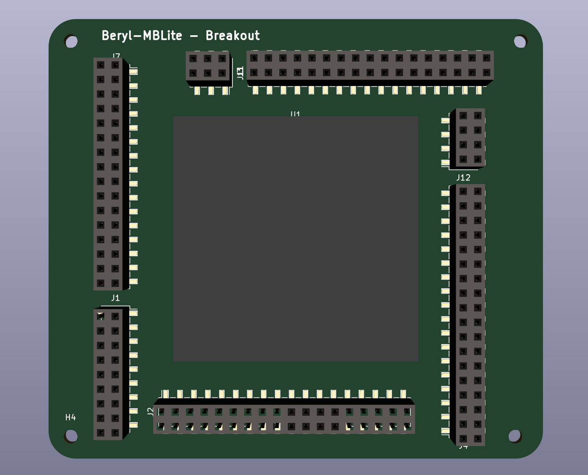
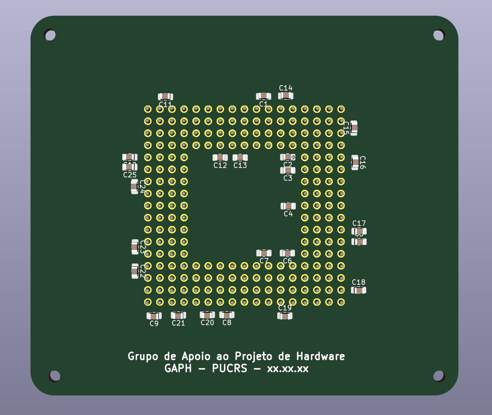

Beryl Breakout Board

Simple, breakout for the huge IC made in the past.
This is still a work in progress.

> This project uses Kicad 5.6.1

[Beryl MBLite Soc](https://corfu.pucrs.br/svn/mblite-chip/) was finished in March 2014 and can be accessed through GAPH's old SVN.
